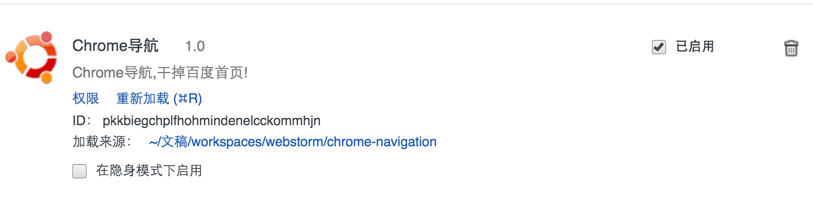
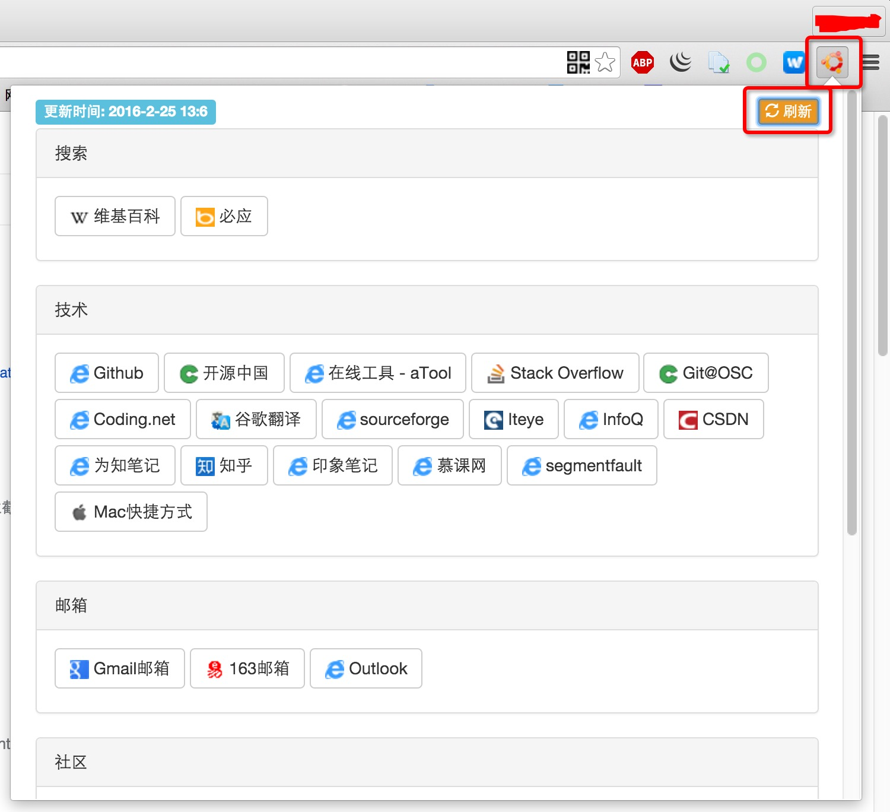
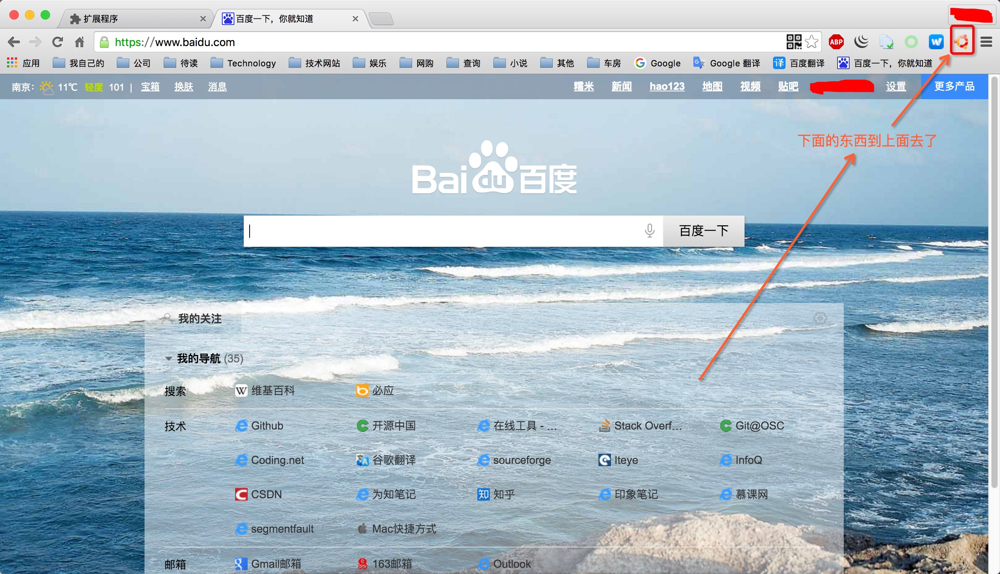

# chrome-navigation

## 介绍

	The navigation extensions for chrome instead of Baidu's Home Page! 
	替代百度首页的导航!
	
## 使用
1. chrome浏览器打开扩展程序
2. 首先勾选开发者模式
3. 加载已解压的扩展程序(没钱不能上架)
4. 选择本文件夹即可

5. 打开之后的效果

6. 百度首页导航

## 获取源码
`git clone https://git.oschina.net/chrome-plugins/chrome-navigation.git`

## 联系我
1. Email: sunhao.java@gmail.com
2. QQ: 867885140
3. Blog: [OSChina][]

## License
The Spring Framework is released under version 2.0 of the [Apache License][].

[Apache License]: http://www.apache.org/licenses/LICENSE-2.0
[OSChina]: http://my.oschina.net/sunhaojava/blog